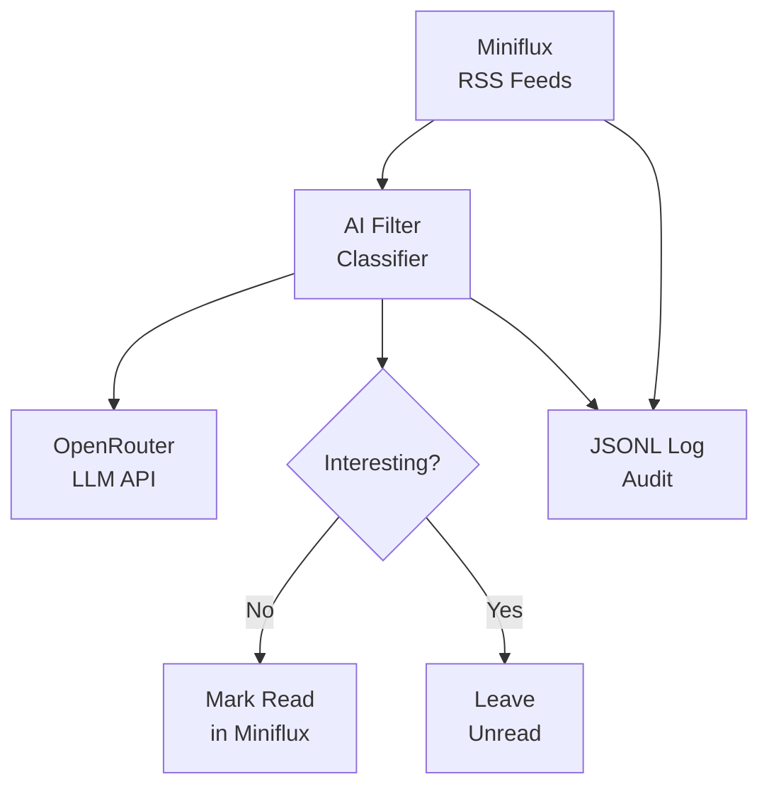

# Miniflux Non-Interesting As Read

A Python tool that automatically classifies unread Miniflux articles using an LLM (via OpenRouter) and marks non-interesting ones as read — so you never have to wade through articles you don't care about.

## Features

- Fetches unread articles from a Miniflux RSS reader instance
- Classifies each article as **interesting** or **not interesting** using an LLM (OpenAI-compatible API via OpenRouter)
- Automatically marks non-interesting articles as read in Miniflux
- Configurable via environment variables
- Full audit trail via JSONL logging
- Supports multiple feed IDs

## Prerequisites

- Python 3.12+
- A running [Miniflux](https://miniflux.app/) instance with an API token
- An [OpenRouter](https://openrouter.ai/) API key

## Installation

This project uses [uv](https://docs.astral.sh/uv/) for package management.

```bash
# Clone the repository
git clone https://github.com/kylesezhi/miniflux-noninteresting-as-read.git
cd miniflux-noninteresting-as-read

# Install dependencies
uv sync

# Copy and configure environment variables
cp .env.example .env
```

## Configuration

Set the following environment variables in your `.env` file:

| Variable | Required | Description |
|---|---|---|
| `MINIFLUX_URL` | Yes | Base URL of your Miniflux instance (e.g., `https://reader.example.com`) |
| `MINIFLUX_API_TOKEN` | Yes | Miniflux API authentication token |
| `MINIFLUX_FEED_IDS` | Yes | Comma-separated list of feed IDs to process (e.g., `1,2,3`) |
| `OPENROUTER_API_KEY` | Yes | OpenRouter API key for LLM access |

The following constants are configured in the source code:

| Constant | Default | Description |
|---|---|---|
| `MAX_ARTICLES_PER_RUN` | `100` | Maximum articles to process per execution |
| `OPENROUTER_MODEL` | `openai/gpt-oss-120b:free` | LLM model used for classification |

## Usage

```bash
uv run python -m miniflux_ai_filter
```

The tool will:

1. Load configuration from environment variables
2. Generate a unique run ID
3. Fetch unread articles from the configured Miniflux feeds
4. Sort articles newest-first
5. Limit to `MAX_ARTICLES_PER_RUN` articles
6. Classify each article using the LLM
7. Mark non-interesting articles as read in Miniflux
8. Write a JSONL audit log entry for every processed article

## How It Works



## Classification Topics

The LLM classifies articles based on the following topic preferences:

**Interesting topics** (kept as unread):
- Programming
- AI / Machine Learning
- Science
- Cybersecurity
- Space
- Technology
- Engineering
- General interesting news

**Uninteresting topics** (marked as read):
- Cars
- Motorcycles
- Sports

The classifier filters only when the **primary topic** of an article is unwanted. Incidental mentions of uninteresting topics within an otherwise interesting article will not trigger filtering.

## Project Structure

```
miniflux-noninteresting-as-read/
├── pyproject.toml          # Project metadata and dependencies
├── .env.example            # Environment variable template
├── .gitignore              # Git ignore rules
├── README.md               # This file
├── logs/                   # JSONL audit logs
│   └── .gitkeep
├── scripts/
│   └── calibrate.py        # LLM calibration / edge-case validation
├── tests/
│   ├── __init__.py
│   ├── conftest.py         # Shared fixtures (mock clients, sample articles)
│   ├── test_classifier.py  # Classifier unit tests (formatting, parsing, classification)
│   ├── test_config.py      # Configuration parsing and validation tests
│   ├── test_logging.py     # JSONL audit trail tests
│   ├── test_miniflux.py    # Miniflux API client tests
│   ├── test_opencodego.py  # Opencode Go client tests
│   └── test_openrouter.py  # OpenRouter client tests
└── src/
    └── miniflux_ai_filter/
        ├── __init__.py     # Package initialization
        ├── __main__.py     # Entry point
        ├── config.py       # Configuration management
        ├── miniflux.py     # Miniflux API client
        ├── models.py       # Data models (Article, ClassificationResult, etc.)
        ├── openrouter.py   # OpenRouter LLM client
        ├── opencodego.py   # Opencode Go LLM client
        ├── protocols.py    # LLMClient protocol and base exceptions
        ├── classifier.py   # Article classification logic
        ├── logging.py      # JSONL audit trail
        └── main.py         # Orchestration
```

## Logging

Every processed article produces a JSONL entry in `logs/classifier.jsonl` with the following fields:

- `run_id` — Unique identifier for each execution
- `timestamp` — When the classification occurred
- `article_id` — Miniflux article ID
- `feed_id` — Miniflux feed ID
- `title` — Article title
- `url` — Article URL
- `published_at` — Original publication date
- `interesting` — Boolean classification result
- `reason` — LLM-provided explanation
- `model` — LLM model used

LLM failures and Miniflux update failures are also logged.

## Development

### Unit Tests

The project uses [pytest](https://docs.pytest.org/) for unit testing with mocked HTTP clients — no real API credentials are needed.

```bash
# Run all tests
uv run pytest

# Run with verbose output
uv run pytest -v

# Run a specific test file
uv run pytest tests/test_classifier.py

# Run a specific test class
uv run pytest tests/test_classifier.py::TestParseResponse

# Run a specific test
uv run pytest tests/test_classifier.py::TestParseResponse::test_valid_json
```

Tests cover:

| Module | Tests | Key scenarios |
|---|---|---|
| `classifier.py` | 24 | Article formatting, content truncation, JSON parsing, LLM error handling, edge case classification |
| `config.py` | 13 | Feed ID parsing, missing required fields, default values, provider config |
| `miniflux.py` | 9 | Entry deserialization, feed fetching, mark-as-read, error handling, URL construction |
| `opencodego.py` | 11 | Payload construction, response extraction, HTTP errors, timeouts, auth headers |
| `openrouter.py` | 10 | Same coverage as Opencode Go client |
| `logging.py` | 6 | JSONL output, multiple entries, directory creation, error logging |

### Calibration Script

The calibration script sends each edge-case article to your configured LLM provider and reports whether the classification was correct. This is useful for validating prompt quality against a real model.

**Edge cases tested:**

| Article | Expected | Category |
|---|---|---|
| "Tesla announces new vehicle lineup" | Filter (not interesting) | Cars |
| "MotoGP championship results" | Filter (not interesting) | Motorcycles |
| "NFL season preview" | Filter (not interesting) | Sports |
| "AI model trains Tesla robot" | Keep (interesting) | AI / programming |
| "NASA spacecraft software update" | Keep (interesting) | Space / engineering |
| "Linux kernel security vulnerability" | Keep (interesting) | Cybersecurity |

```bash
# Requires a properly configured .env file with real API credentials
uv run python scripts/calibrate.py
```

If any edge cases fail, tune the `SYSTEM_PROMPT` in `src/miniflux_ai_filter/classifier.py` and re-run the calibration script.

### Manual Testing

Run the tool and inspect the JSONL logs to review classification quality:

```bash
uv run python -m miniflux_ai_filter
cat logs/classifier.jsonl | jq .
```

## Deployment

### PM2 (Recommended)

[PM2](https://pm2.keymetrics.io/) is a production process manager that can run the pipeline on a schedule, restart it if it fails, and manage log output.

#### Install PM2

```bash
npm install -g pm2
```

#### Configure

An `ecosystem.config.js` is provided at the project root. It runs the pipeline once per hour (on the hour) using `uv run python -m miniflux_ai_filter`.

Key settings in the config:

| Setting | Value | Description |
|---|---|---|
| `cron_restart` | `0 * * * *` | Runs every hour on the hour |
| `autorestart` | `false` | Script exits after each run; cron handles rescheduling |
| `error_file` | `logs/pm2/err.log` | PM2 stderr log |
| `out_file` | `logs/pm2/out.log` | PM2 stdout log |

#### Install Dependencies

Before starting the process, install the project dependencies:

```bash
cd /path/to/miniflux-noninteresting-as-read
uv sync
```

#### Start the Process

```bash
cd /path/to/miniflux-noninteresting-as-read
pm2 start ecosystem.config.js
```

#### Save Process List

After starting, save the process list so PM2 can resurrect it on reboot:

```bash
pm2 save
```

#### Enable Startup Script

Configure PM2 to automatically start on system boot:

```bash
pm2 startup
```

This prints a command you need to run with `sudo`. Follow the instructions.

#### Check Status

```bash
pm2 status
pm2 logs miniflux-ai-filter   # tail recent output
pm2 logs miniflux-ai-filter --lines 100  # last 100 lines
```

#### Stop or Restart

```bash
pm2 stop miniflux-ai-filter
pm2 restart miniflux-ai-filter
```

### Log Rotation

Two layers of log rotation are configured:

#### 1. PM2 Logs (stdout/stderr)

Install and configure the `pm2-logrotate` module to manage PM2's own log files:

```bash
pm2 install pm2-logrotate
pm2 set pm2-logrotate:max_size 10M
pm2 set pm2-logrotate:retain 7
pm2 set pm2-logrotate:compress true
```

#### 2. JSONL Audit Trail

The project writes classification decisions to `logs/classifier.jsonl`. A system `logrotate` configuration is provided at `logrotate.d/miniflux-ai-filter`.

Install it (adjust the path to match your deployment):

```bash
sudo cp logrotate.d/miniflux-ai-filter /etc/logrotate.d/
```

The config in the file rotates the JSONL log **daily** and retains **30 days** of history. It uses `copytruncate` so the pipeline can continue writing safely without needing a restart.

### Customizing the Execution Interval

To change how often the pipeline runs, edit the `cron_restart` value in `ecosystem.config.js` and restart PM2:

```javascript
cron_restart: "0 * * * *",   // every hour (default)
cron_restart: "*/30 * * * *", // every 30 minutes
cron_restart: "0 */6 * * *",  // every 6 hours
```

Then reload:

```bash
pm2 restart ecosystem.config.js
```

### Alternative: System Cron

If you prefer not to use PM2, first install the project dependencies:

```bash
cd /path/to/miniflux-noninteresting-as-read
uv sync
```

Then add a simple cron entry:

```cron
# Run every hour
0 * * * * cd /path/to/miniflux-noninteresting-as-read && uv run python -m miniflux_ai_filter >> logs/cron.log 2>&1
```

### Monitoring Failures

- **PM2 logs**: `pm2 logs miniflux-ai-filter` shows stdout/stderr in real time
- **JSONL audit log**: Errors are logged to `logs/classifier.jsonl` with `error_type` and `error_message` fields — inspect with `jq`:
  ```bash
  jq 'select(.error_type != null)' logs/classifier.jsonl
  ```
- **Exit codes**: The pipeline exits with a non-zero code on failure, which PM2 or cron will report

### File Layout

```
miniflux-noninteresting-as-read/
├── ecosystem.config.js           # PM2 process configuration
├── logrotate.d/
│   └── miniflux-ai-filter        # System logrotate config for JSONL audit trail
├── logs/
│   ├── .gitkeep
│   ├── classifier.jsonl          # JSONL audit trail (rotated via logrotate)
│   └── pm2/                      # PM2 stdout/stderr logs (rotated via pm2-logrotate)
│       ├── err.log
│       └── out.log
└── src/...
```

## License

MIT