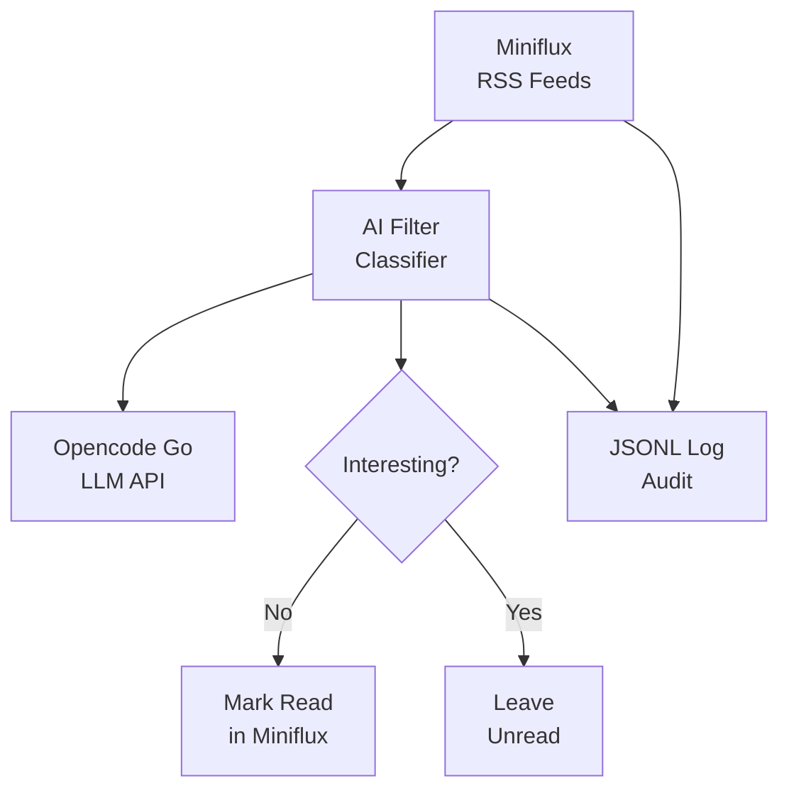

# Miniflux Non-Interesting As Read

A Python tool that automatically classifies unread Miniflux articles using an LLM (via Opencode Go) and marks non-interesting ones as read — so you never have to wade through articles you don't care about.

## Features

- Fetches unread articles from a Miniflux RSS reader instance
- Classifies each article as **interesting** or **not interesting** using an LLM (Opencode Go, with OpenRouter as a fallback)
- Automatically marks non-interesting articles as read in Miniflux
- Configurable via environment variables
- Full audit trail via JSONL logging
- Supports multiple feed IDs

## Prerequisites

- Python 3.12+
- A running [Miniflux](https://miniflux.app/) instance with an API token
- An [Opencode Go](https://opencode.ai/) API key

## Installation

This project uses [uv](https://docs.astral.sh/uv/) for package management.

```bash
# Clone the repository
git clone https://github.com/kylesezhi/miniflux-noninteresting-as-read.git
cd miniflux-noninteresting-as-read

# Install dependencies
uv sync

# Copy and configure environment variables
cp .env.example .env
```

## Configuration

### Environment Variables

Set the following environment variables in your `.env` file:

| Variable | Required | Description |
|---|---|---|
| `MINIFLUX_URL` | Yes | Base URL of your Miniflux instance (e.g., `https://reader.example.com`) |
| `MINIFLUX_API_TOKEN` | Yes | Miniflux API authentication token |
| `OPENCODEGO_API_KEY` | Yes | Opencode Go API key |
| `OPENROUTER_API_KEY` | No | OpenRouter API key (required when `LLM_PROVIDER=openrouter`) |
| `LLM_PROVIDER` | No | LLM provider: `opencodego` (default) or `openrouter` |
| `OPENCODEGO_MODEL` | No | Opencode Go model (default: `deepseek-v4-flash`) |
| `OPENCODEGO_TIMEOUT_SECONDS` | No | Opencode Go request timeout (default: `60`) |
| `OPENROUTER_MODEL` | No | OpenRouter model (default: `openai/gpt-oss-120b:free`) |
| `MAX_ARTICLES_PER_RUN` | No | Maximum articles per feed per run (default: `100`) |
| `CLASSIFICATION_DELAY_SECONDS` | No | Delay between LLM calls in seconds (default: `2`) |

### Feed Configuration

Feeds are configured via `feeds.yaml`. Each feed entry defines:

- `feed_id`: The numeric Miniflux feed ID
- `max_articles`: Maximum articles to process per run (optional, defaults to 100)
- `prompt`: The classification system prompt for this feed

Example:

```yaml
feeds:
  - feed_id: 3
    max_articles: 100
    prompt: |
      You are a content classifier. Given an article's details,
      determine whether it is interesting or not.
      Respond with a JSON object containing exactly two fields:
        "interesting": true or false
        "reason": a short explanation for your decision

      Rules:
      - Only filter when the primary topic is unwanted.
      - Do not filter incidental mentions of unwanted topics.

      Interested topics: programming, AI, science, cybersecurity,
      space, technology, engineering, general interesting news.
      Uninteresting topics: cars, motorcycles, sports.
```

## Usage

```bash
uv run python -m miniflux_ai_filter
```

The tool will:

1. Load configuration from environment variables and `feeds.yaml`
2. Generate a unique run ID
3. For each configured feed:
   1. Fetch unread articles from Miniflux
   2. Sort articles newest-first
   3. Limit to the feed's `max_articles`
   4. Classify each article using the feed's prompt via the LLM
   5. Mark non-interesting articles as read in Miniflux
   6. Write a JSONL audit log entry for every processed article
   7. Pause between LLM calls to respect rate limits
4. Print per-feed and aggregate summary

## How It Works



## Logging

Every processed article produces a JSONL entry in `logs/classifier.jsonl` with full audit details (run ID, article metadata, classification result, model used, and prompt). LLM and Miniflux failures are also logged.

## Development

```bash
# Run all tests (no API credentials needed)
uv run pytest

# Calibrate prompts against real LLM (requires configured .env)
uv run python scripts/calibrate.py
```

## Deployment

### PM2 (Recommended)

An `ecosystem.config.js` is provided — it runs the pipeline hourly via cron.

```bash
npm install -g pm2
uv sync
pm2 start ecosystem.config.js
pm2 save
pm2 startup   # auto-start on boot
```

To change the schedule, edit `cron_restart` in `ecosystem.config.js`, then:
```bash
pm2 delete miniflux-ai-filter && pm2 start ecosystem.config.js && pm2 save
```

### Log Rotation

- **PM2 logs**: `pm2 install pm2-logrotate` and configure `max_size`, `retain`, `compress`
- **JSONL audit trail**: A `logrotate.d/miniflux-ai-filter` config is provided (daily rotation, 30-day retention)

### Alternative: System Cron

```cron
0 * * * * cd /path/to/miniflux-noninteresting-as-read && uv run python -m miniflux_ai_filter >> logs/cron.log 2>&1
```

## License

MIT