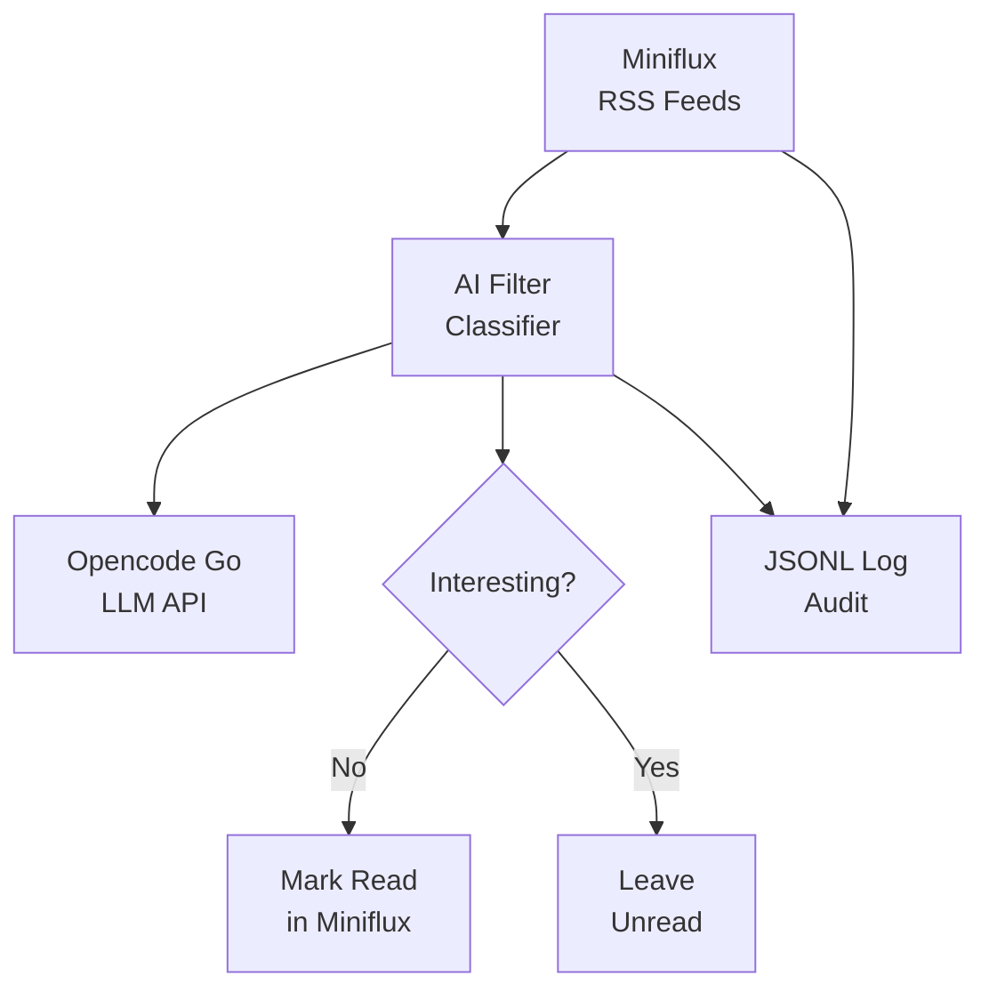

# Miniflux Non-Interesting As Read

A Python tool that automatically classifies unread Miniflux articles using an LLM (via Opencode Go) and marks non-interesting ones as read — so you never have to wade through articles you don't care about.

## Features

- Fetches unread articles from a Miniflux RSS reader instance
- Classifies each article as **interesting** or **not interesting** using an LLM (Opencode Go, with OpenRouter as a fallback)
- Automatically marks non-interesting articles as read in Miniflux
- Configurable via environment variables
- Full audit trail via JSONL logging
- Supports multiple feed IDs

## Prerequisites

- Python 3.12+ (and a shell session with [mise](https://mise.jdx.dev) on PATH)
- A running [Miniflux](https://miniflux.app/) instance with an API token
- An [Opencode Go](https://opencode.ai/) API key

## Installation

This project uses [mise](https://mise.jdx.dev) for tool management (Python, uv,
Node and PM2) and [uv](https://docs.astral.sh/uv/) for Python dependencies.

```bash
# Clone the repository
git clone https://github.com/kylesezhi/miniflux-noninteresting-as-read.git
cd miniflux-noninteresting-as-read

# Install mise (see https://mise.jdx.dev/getting-started.html), then:
mise install          # provision pinned tools (mise.toml / mise.lock)

# Sync Python dependencies
mise run install

# Copy and configure environment variables
cp .env.example .env
```

## Configuration

### Environment Variables

Set the following environment variables in your `.env` file:

| Variable | Required | Description |
|---|---|---|
| `MINIFLUX_URL` | Yes | Base URL of your Miniflux instance (e.g., `https://reader.example.com`) |
| `MINIFLUX_API_TOKEN` | Yes | Miniflux API authentication token |
| `OPENCODEGO_API_KEY` | Yes | Opencode Go API key |
| `OPENROUTER_API_KEY` | No | OpenRouter API key (required when `LLM_PROVIDER=openrouter`) |
| `LLM_PROVIDER` | No | LLM provider: `opencodego` (default) or `openrouter` |
| `OPENCODEGO_MODEL` | No | Opencode Go model (default: `deepseek-v4-flash`) |
| `OPENCODEGO_TIMEOUT_SECONDS` | No | Opencode Go request timeout (default: `60`) |
| `OPENCODEGO_SESSION_ID` | No | Stable `x-opencode-session` ID sent to Opencode Go; empty = fresh session per run |
| `OPENROUTER_MODEL` | No | OpenRouter model (default: `openai/gpt-oss-120b:free`) |
| `MAX_ARTICLES_PER_RUN` | No | Maximum articles per feed per run (default: `100`) |
| `CLASSIFICATION_DELAY_SECONDS` | No | Delay between LLM calls in seconds (default: `2`) |

### Feed Configuration

Feeds are configured via `feeds.yaml`. Each feed entry defines:

- `feed_id`: The numeric Miniflux feed ID
- `max_articles`: Maximum articles to process per run (optional, defaults to 100)
- `prompt`: The classification system prompt for this feed

Example:

```yaml
feeds:
  - feed_id: 3
    max_articles: 100
    prompt: |
      You are a content classifier. Given an article's details,
      determine whether it is interesting or not.
      Respond with a JSON object containing exactly two fields:
        "interesting": true or false
        "reason": a short explanation for your decision

      Rules:
      - Only filter when the primary topic is unwanted.
      - Do not filter incidental mentions of unwanted topics.

      Interested topics: programming, AI, science, cybersecurity,
      space, technology, engineering, general interesting news.
      Uninteresting topics: cars, motorcycles, sports.
```

## Usage

```bash
mise run pipeline
```

The tool will:

1. Load configuration from environment variables and `feeds.yaml`
2. Generate a unique run ID
3. For each configured feed:
   1. Fetch unread articles from Miniflux
   2. Sort articles newest-first
   3. Limit to the feed's `max_articles`
   4. Classify each article using the feed's prompt via the LLM
   5. Mark non-interesting articles as read in Miniflux
   6. Write a JSONL audit log entry for every processed article
   7. Pause between LLM calls to respect rate limits
4. Print per-feed and aggregate summary

## How It Works


```mermaid
graph TD
    M[Miniflux<br/>RSS Feeds] --> AI[AI Filter<br/>Classifier]
    AI --> OG[Opencode Go<br/>LLM API]
    AI --> D{Interesting?}
    D -->|No| MR[Mark Read<br/>in Miniflux]
    D -->|Yes| LU[Leave<br/>Unread]
    M --> L[JSONL Log<br/>Audit]
    AI --> L
```

## Logging

Every processed article produces a JSONL entry in `logs/classifier.jsonl` with full audit details (run ID, article metadata, classification result, model used, and prompt). LLM and Miniflux failures are also logged.

## Web Log Viewer

A lightweight, read-only dashboard for the JSONL audit trail is included.
It serves a single page (inline CSS/JS, no extra dependencies) with
classification logs and errors, summary stats, filter tabs, and 15s
auto-refresh.

```bash
mise run web
```

Open `http://<host>:5000`.

| Variable | Default | Description |
|---|---|---|
| `WEB_HOST` | `0.0.0.0` | Bind interface (`0.0.0.0` = LAN-accessible, no auth) |
| `WEB_PORT` | `5000` | Port to listen on |
| `WEB_LOG_PATH` | `logs/classifier.jsonl` | JSONL audit trail to display |

API: `GET /api/entries?filter=all|errors|classifications&limit=200`.

### Running the viewer under PM2

`ecosystem.config.js` defines a second app, `miniflux-ai-filter-web`
(autorestart daemon, logs to `logs/pm2/web-*.log`). Run
`mise run pm2-start` to pick it up after changes.

## Development

```bash
# Run all tests (no API credentials needed)
mise run test

# Calibrate prompts against real LLM (requires configured .env)
mise run calibrate
```

## Deployment

### PM2 (Recommended)

An `ecosystem.config.js` is provided — it runs the pipeline hourly via cron
and keeps the web log viewer running on port 5000. PM2 is provisioned by
mise (`npm:pm2@7` in `mise.toml`), so always drive it through the mise tasks
(or `mise x npm:pm2 -- pm2 ...`); then PM2's daemon — and the tools it spawns
— resolve mise-managed versions instead of system ones.

```bash
mise run pm2-start    # start both apps (pipeline + web viewer)
mise run pm2-save     # save the process list for resurrection
mise run pm2-status   # keep an eye on things
mise run pm2-logs     # stream logs

mise x npm:pm2 -- pm2 startup   # auto-start on boot (needs sudo)
```

Caveat: `pm2 startup` bakes the path into a systemd unit — with npm:pm2 under
mise, that's the persistent `~/.local/share/mise/shims/pm2` shim, which keeps
working across sessions.

To change the schedule, edit `cron_restart` in `ecosystem.config.js`, then:
```bash
mise run pm2-restart
```

### Log Rotation

- **PM2 logs**: `pm2 install pm2-logrotate` and configure `max_size`, `retain`, `compress`
- **JSONL audit trail**: A `logrotate.d/miniflux-ai-filter` config is provided (daily rotation, 30-day retention)

### Alternative: System Cron

```cron
0 * * * * cd /path/to/miniflux-noninteresting-as-read && uv run python -m miniflux_ai_filter >> logs/cron.log 2>&1
```

## License

MIT